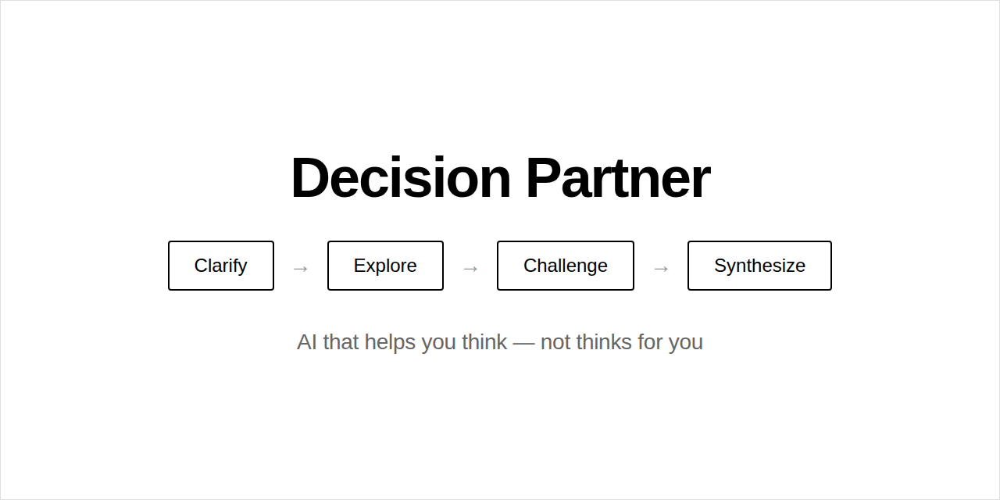

<p align="center">
  
</p>

<p align="center">
  <a href="https://huggingface.co/spaces/chadsellers/decision-partner">Live Demo</a> ·
  <a href="https://linkedin.com/in/chadsellers">LinkedIn</a> ·
  <a href="#how-it-works">How It Works</a> ·
  <a href="#installation">Installation</a>
</p>

---

## What is this?

A multi-agent AI system that helps you think through complex decisions.

Four agents. One rule: **no agent tells you what to choose.**

```
Clarify → Explore → Challenge → Synthesize
```

The system guides you through a structured thinking process and ends with a question, not a recommendation.

---

## How It Works

| Agent | Role |
|-------|------|
| **Clarifier** | Surfaces the real decision beneath what you asked |
| **Explorer** | Expands options you might not have considered |
| **Challenger** | Tests your assumptions |
| **Synthesizer** | Compiles insights — without telling you what to do |

Each agent reads from and writes to shared state. The sequence matters.

---

## The Philosophy

Most AI answers questions as fast as possible.

Some questions shouldn't be answered quickly. They should be explored.

> "AI's highest value isn't in doing your thinking for you — it's in helping you think more clearly."

**The pipeline is the product.**

---

## Try It

**Live demo:** [huggingface.co/spaces/chadsellers/decision-partner](https://huggingface.co/spaces/chadsellers/decision-partner)

Works best with complex, personal decisions:
- Career changes
- Relationship crossroads
- Life transitions
- Business decisions
- Hard conversations

---

## Installation

```bash
# Clone
git clone https://github.com/chadsellers-24-7-365/decision-partner.git
cd decision-partner

# Install
pip install -r requirements.txt

# Set your Hugging Face token
export HF_TOKEN="your_token_here"

# Run
python app.py
```

Open `http://localhost:7860` in your browser.

---

## Architecture

```
┌─────────────────────────────────────────┐
│            USER INPUT                   │
│      "I'm deciding whether to..."       │
└─────────────────┬───────────────────────┘
                  │
                  ▼
┌─────────────────────────────────────────┐
│            CLARIFIER                    │
│   "What are you really deciding?"       │
└─────────────────┬───────────────────────┘
                  │
                  ▼
┌─────────────────────────────────────────┐
│            EXPLORER                     │
│   "What options haven't you seen?"      │
└─────────────────┬───────────────────────┘
                  │
                  ▼
┌─────────────────────────────────────────┐
│            CHALLENGER                   │
│   "What if the opposite were true?"     │
└─────────────────┬───────────────────────┘
                  │
                  ▼
┌─────────────────────────────────────────┐
│            SYNTHESIZER                  │
│   "Here's what's clearer now..."        │
│   (ends with a question, not advice)    │
└─────────────────────────────────────────┘
```

Built with [LangGraph](https://langchain-ai.github.io/langgraph/) for multi-agent orchestration.

---

## Code Structure

```
decision-partner/
├── app.py              # Main application (agents + UI)
├── requirements.txt    # Dependencies
├── README.md          # This file
└── banner.png         # Header image
```

The entire system is ~280 lines. Intentionally simple.

---

## Key Implementation

The orchestration is just a graph:

```python
from langgraph.graph import StateGraph, START, END

workflow = StateGraph(DecisionState)

workflow.add_node("clarifier", clarifier)
workflow.add_node("explorer", explorer)
workflow.add_node("challenger", challenger)
workflow.add_node("synthesizer", synthesizer)

workflow.add_edge(START, "clarifier")
workflow.add_edge("clarifier", "explorer")
workflow.add_edge("explorer", "challenger")
workflow.add_edge("challenger", "synthesizer")
workflow.add_edge("synthesizer", END)

app = workflow.compile()
```

Each agent is a function that reads state, calls an LLM with a specific prompt, and returns updated state.

---

## Adapt It

Fork this and build your own thinking partner:

- **Career Coach** — Focus on job transitions
- **Startup Advisor** — Business decisions
- **Relationship Navigator** — Difficult conversations
- **Learning Path Designer** — Education choices

The architecture is the gift. The application is yours.

---

## Requirements

- Python 3.9+
- Hugging Face account with API token
- Token needs "Make calls to Inference Providers" permission

---

## License

MIT — Use freely, adapt generously, build thoughtfully.

---

## Author

**Chad Sellers**

- [LinkedIn](https://linkedin.com/in/chadsellers)
- [Hugging Face](https://huggingface.co/chadsellers)
- [GitHub](https://github.com/chadsellers-24-7-365)

M.S. in AI/ML · Senior Systems Engineer · Building AI that empowers rather than replaces.

---

<p align="center">
  <em>Think clearer. Decide better. Move forward.</em>
</p>
